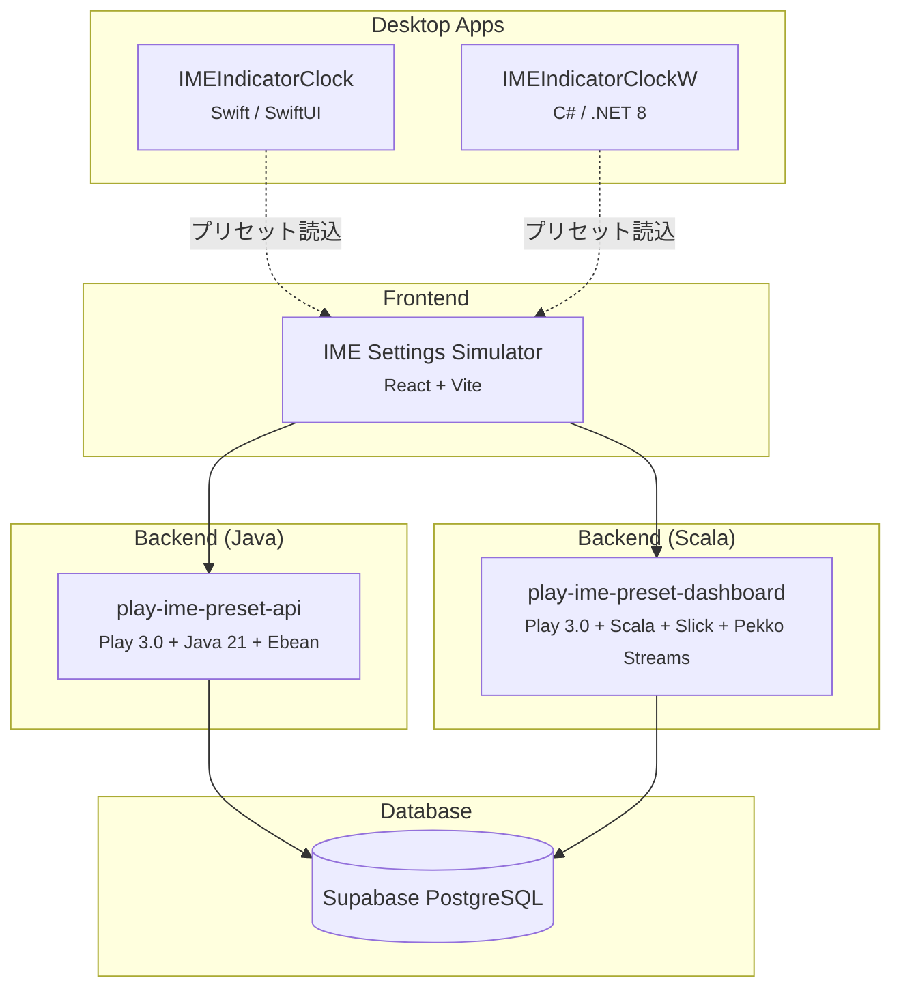

# 👋 こんにちは、obott9です

[English](README.md)

**シニアソフトウェアエンジニア** | Swift & C# | クロスプラットフォーム開発者 | 問題解決のプロフェッショナル

---

## 🎯 自己紹介

「動くコード」ではなく、「なぜ動くのか」を理解することを大切にするソフトウェアエンジニアです。問題の根本原因を深く掘り下げ、堅牢で保守しやすく、将来にわたって価値を提供するソリューションを作ることにこだわっています。

**私の仕事の特徴:**

- 🔍 応急処置より本質的な理解
- 💡 開発者体験を向上させる実用的なソリューション
- 🛠️ ツールの習熟とワークフローの最適化
- 📝 ナレッジの体系的な記録と継続的な学習
- 🤖 **AI活用の実践者** — Claude AI等を開発ワークフローに統合し、35年の経験と組み合わせて生産性を最大化

---

## 💻 技術スタック

### デスクトップ

### Web / Backend

### デスクトップツール

### プラットフォーム

### ツール＆プラクティス

- **開発環境**: Xcode, Visual Studio, VS Code, Git, ユニットテスト
- **AI支援開発**: Claude, GitHub Copilot
- **コード品質**: 保守性とドキュメンテーションを重視
- **ワークフロー**: 自動ログ記録、構造化された問題解決

---

## 🌟 私の強み

### 1. 🎯 根本原因の分析力

表面的な回避策に満足しません。`assertionFailure`の挙動問題に直面した際、表層だけでなく根本を掘り下げ、`NSClassFromString("XCTestCase")`を使った実行環境判定のような堅牢なソリューションを見つけ出します。

### 2. 🌐 クロスプラットフォーム開発

macOSとWindows両方のアプリケーションを開発し、各プラットフォームのネイティブ機能を活かしながら一貫したユーザー体験を提供します。

### 3. 💡 開発者体験を重視した発想力

開発ワークフローの改善を常に考えています。例えば、テスト環境だけでなくプレビュー環境でも動作するようにすることで、開発サイクル全体をスムーズにします。

### 4. 🔧 ツールへの深い理解

プラットフォームを跨いだ開発ツールやビルドシステムを深く理解しています。単なる使い方ではなく、その仕組みを理解した上で活用できます。

### 5. 📊 品質重視の開発

- 予防的な設計（文字エンコーディング検出戦略など）
- 包括的なエラーハンドリング
- 詳細なログ記録とドキュメンテーション
- 将来を見据えたコードアーキテクチャ

---

## 🚀 スキル＆専門性

**技術的能力:**

- ⭐⭐⭐⭐⭐ 問題解決＆デバッグ
- ⭐⭐⭐⭐⭐ ソフトウェアアーキテクチャ＆設計
- ⭐⭐⭐⭐⭐ クロスプラットフォーム開発（macOS/Windows）
- ⭐⭐⭐⭐⭐ Xcode & Visual Studio
- ⭐⭐⭐⭐☆ Swift/Objective-C
- ⭐⭐⭐⭐☆ C#/.NET

**プロフェッショナルとしての強み:**

- 批判的思考: 常に「これが本当にベストな解決策か？」を問う
- 実用主義: 理論と実用性のバランスを取る
- 自己認識: 思い込みを認識し、結論を出す前に検証する
- 協調性: 効果的なコミュニケーションとナレッジ共有

---

## 💼 理想的な役割

以下のようなポジションで力を発揮できます:

- 🎨 アーキテクチャの決定と技術選定
- 👨‍🏫 エンジニアのメンタリングとコードレビュー
- 🔍 複雑な技術課題への取り組み
- 🛠️ 開発者の生産性を向上させるツール開発
- 📈 技術的イニシアチブのリード
- 🌐 クロスプラットフォームソリューションの開発

**希望職種:** デスクトップ/モバイル開発におけるシニアエンジニア、テックリード、スタッフエンジニア

---

## 🎓 哲学

> 「ただ動かすだけでなく、なぜ動くのかを理解し、より良くし、未来のために記録する。」

優れたエンジニアとは:

- あらゆることに疑問を持つ（AIの提案も含めて）
- ツールを深いレベルで理解する
- 完璧主義と実用主義のバランスを取る
- ナレッジを惜しみなく共有する

このような人だと信じています。

---

## 🚀 主要プロジェクト

### [IMEIndicatorClock](https://github.com/obott9/IMEIndicatorClock) (macOS)

IME（入力メソッドエディタ）の状態とカスタマイズ可能なデスクトップ時計を視覚的に表示するmacOSユーティリティアプリです。日本語、中国語、韓国語など複数の言語を切り替えて使うユーザーに最適です。

**特徴:**

- 🌐 12言語以上をサポート（日本語、中国語、韓国語、タイ語、ベトナム語、アラビア語、ヘブライ語、ヒンディー語、ロシア語、ギリシャ語など）
- ⏰ IME状態表示付きのカスタマイズ可能なアナログ/デジタル時計
- 🖱️ テキスト入力に便利なマウスカーソルインジケータ
- 🎨 外観を自由にカスタマイズ（サイズ、色、透明度）

---

### [IMEIndicatorClockW](https://github.com/obott9/IMEIndicatorClockW) (Windows)

IMEIndicatorClockのWindows移植版。IME状態とカスタマイズ可能なデスクトップ時計を視覚的に表示するWindowsユーティリティアプリです。

**特徴:**

- 🌐 18言語以上をサポート（アジア、中東、ヨーロッパの主要言語を網羅）
- ⏰ 和暦表示対応のアナログ/デジタル時計
- 🖱️ テキスト入力に便利なマウスカーソルインジケータ
- 🖥️ マルチディスプレイ対応
- 🎨 外観を自由にカスタマイズ

---

### [IME Settings Simulator](https://github.com/obott9/ime-simulator) (Web App)

IMEIndicatorClockの設定をブラウザ上でプレビュー・カスタマイズできるフルスタックWebアプリケーションです。プリセットの保存・共有・いいね機能を備えています。

**特徴:**

- 🕐 時計・インジケータ設定のライブプレビュー
- 💾 プリセット保存・共有・いいねシステム（GitHub OAuth認証）
- 🌐 5言語対応（日本語・英語・韓国語・中国語繁体字・中国語簡体字）
- ☁️ 3層アーキテクチャ（React → Express API → Supabase）

🔗 [ライブデモ](https://obott9.github.io/ime-simulator/) | [リポジトリ](https://github.com/obott9/ime-simulator)

---

### [GitHub Download Counter](https://github.com/obott9/github-download-counter) (Web App)

GitHub Releasesのダウンロード統計を視覚化するシングルページアプリケーションです。GitHub REST API v3を使い、複数リポジトリのデータを並列取得します。

**特徴:**

- ⚡ Promise.allによるN個のリポジトリの並列API呼び出し
- 📊 APIレート制限のリアルタイム表示
- 🎨 フェードインアニメーション付きレスポンシブデザイン

🔗 [ライブデモ](https://obott9.github.io/github-download-counter/) | [リポジトリ](https://github.com/obott9/github-download-counter)

---

### [File Tab Opener](https://github.com/obott9/file_tab_opener) (Cross-platform)

フォルダグループをFinder/Explorerのタブとして一括オープンするクロスプラットフォームデスクトップユーティリティです。

**特徴:**

- 📂 フォルダグループを名前付きプリセットとして保存・一括オープン
- 🌐 5言語対応（日本語・英語・韓国語・中国語繁体字・中国語簡体字）
- 🧪 68のユニットテストで品質を担保
- 🖥️ macOS（Finder）& Windows（Explorer）の両対応
- 🔄 3段階のフォールバックアーキテクチャで高い互換性

🔗 [リポジトリ](https://github.com/obott9/file_tab_opener)

---

### [FileTabOpenerM](https://github.com/obott9/FileTabOpenerM) (macOS)

File Tab Opener の macOS ネイティブ版。SwiftUI で再構築し、AX API + AppleScript のハイブリッドアプローチで Finder タブを確実に制御します。

**特徴:**

- 🖥️ SwiftUI ネイティブ UI（ダークモード、ドラッグ&ドロップ自動対応）
- 🔧 AX API + AppleScript ハイブリッドでキーボード操作不要
- 📐 モダンレイアウト（サイドバー + 詳細パネル）+ クラシックレイアウト
- 🌐 5言語対応（英語・日本語・韓国語・繁体字中国語・簡体字中国語）

🔗 [リポジトリ](https://github.com/obott9/FileTabOpenerM)

---

### [FileTabOpenerW](https://github.com/obott9/FileTabOpenerW) (Windows)

File Tab Opener の Windows ネイティブ版。純粋な C++/Win32 API で再構築し、UI Automation API で Explorer タブを確実に制御します。

**特徴:**

- 🖥️ C++17 / Win32 ネイティブ（外部フレームワーク不使用、高速起動）
- 🔧 UI Automation API で Explorer タブを直接操作（キーボード操作不要）
- 📐 コンパクトレイアウト + サイドバーレイアウト（macOS SwiftUI版から移植）
- 🌙 Windows ダーク/ライトテーマ自動追従
- 🌐 5言語対応（英語・日本語・韓国語・繁体字中国語・簡体字中国語）

🔗 [リポジトリ](https://github.com/obott9/FileTabOpenerW)

---

### [Play IME Preset API](https://github.com/obott9/play-ime-preset-api) (Backend — Java)

IMEIndicatorClockのプリセット管理用REST API。Play Framework 3.0 + Java 21 + Ebean ORMでCRUD操作を提供。Supabase PostgreSQLに接続。

**特徴:**

- 🔗 9つのRESTエンドポイント（CRUD、いいね、共有、人気プリセット）
- 🗃️ Ebean ORM によるシンプルなJava標準のDB操作
- 🔒 環境変数ベースの設定管理

🔗 [リポジトリ](https://github.com/obott9/play-ime-preset-api)

---

### [Play IME Preset Dashboard](https://github.com/obott9/play-ime-preset-dashboard) (Backend — Scala)

同じプリセット管理APIをScalaの関数型プログラミングパターンで再実装。Slick FRMによる型安全なクエリとPekko StreamsによるSSEリアクティブストリーミングを実装。

**特徴:**

- 🔄 Pekko Streams によるServer-Sent Events（SSE）ストリーミング
- 🛡️ Option/Either による関数型エラーハンドリング（例外なし）
- 🗃️ Slick FRM による型安全・コンポーザブルなクエリ

🔗 [リポジトリ](https://github.com/obott9/play-ime-preset-dashboard)

---

## 🏗️ IME エコシステム構成

同じデータベースに対して複数の実装 — 言語の多様性を実証:

---

## 📫 連絡先

📧 **メール**: obott9.dev [at] gmail [dot] com

💼 [**LinkedIn**](https://www.linkedin.com/in/hideki-obote-1b33b43a7/) | 🌐 [**ポートフォリオ**](https://obott9.github.io)

---

## 💖 サポート

私のプロジェクトが役に立ったら、サポートをご検討ください！

---

## 🤖 開発について

アーキテクチャ設計、多言語ローカライゼーション、ドキュメント作成に Claude AI を活用しています。

---

## 📊 GitHub統計

---

*最終更新: 2026年4月*
